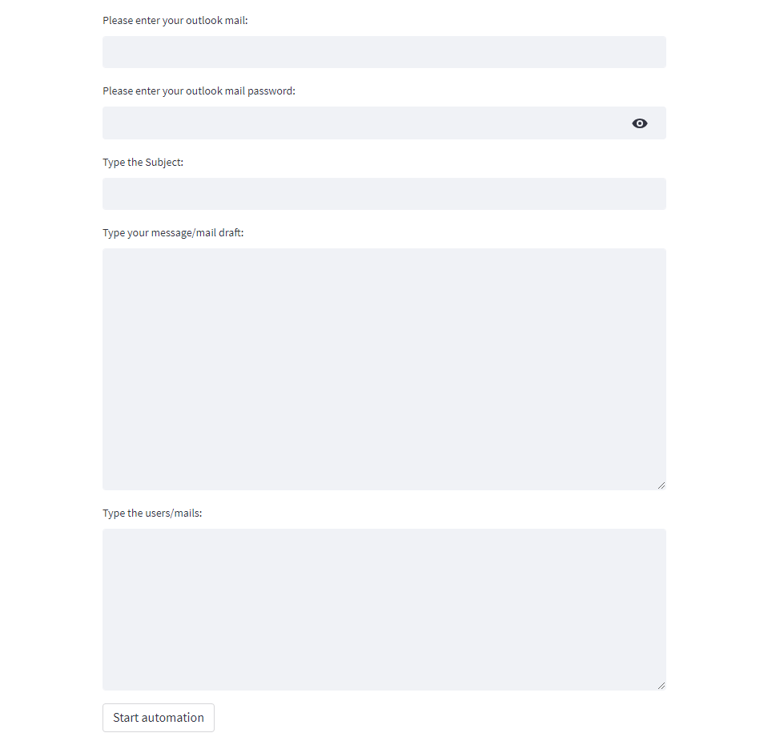

# Outlook Automation

This is a Python script that automates the process of sending emails using Microsoft Outlook. 
The script uses the `streamlit` library for creating a user interface and the `selenium` library for browser automation.

## Prerequisites

Before running the script, make sure you have the following dependencies installed:

- Python 3.x
- streamlit library: You can install it by running pip install streamlit.
- selenium library: You can install it by running pip install selenium.
- Chrome web browser: The script uses ChromeDriver for browser automation. Make sure you have Chrome installed on your system.

## Usage
1. Clone the repository or copy the script into your local environment.
2. Install the required dependencies mentioned in the "Prerequisites" section.
3. Open a terminal or command prompt and navigate to the directory where the script is located.
4. Run the following command to start the script:

   `streamlit run main.py`

5. The script will launch a web-based user interface using Streamlit. Enter your Outlook email and password when prompted.
6. Provide the subject of the email and the message content.
7. Enter the recipient email addresses in the designated area, with each email address on a separate line.
8. Click the "Start automation" button to initiate the email sending process.
9. The script will open a Chrome browser window, log in to your Outlook account, and start sending emails to the specified recipients.
10. Wait for the process to complete. The script will display a success message when all emails are sent.

**Note:** The script uses XPath and CSS selectors to locate elements on webpages. 
If the script encounters any issues locating elements, it may need adjustments based on the structure of the Outlook website.
**Outlook website's language must be English.**

### Disclaimer
Please use this script responsibly and in compliance with the terms of service of the email service provider. 
Be cautious while automating email sending processes to avoid potential misuse or spamming.

## Images from Streamlit-App:

## Tutorial Video:

Watch after 10. minutes the video.

https://www.youtube.com/watch?v=xMQNfLg1WTI&pp=ygUPaGFzYW4gYmFyaXMgZ29r

